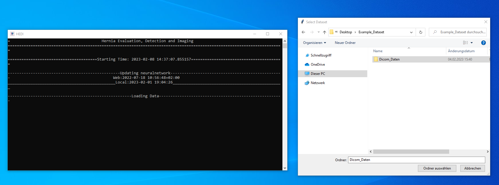
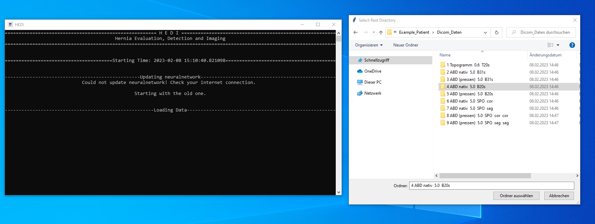
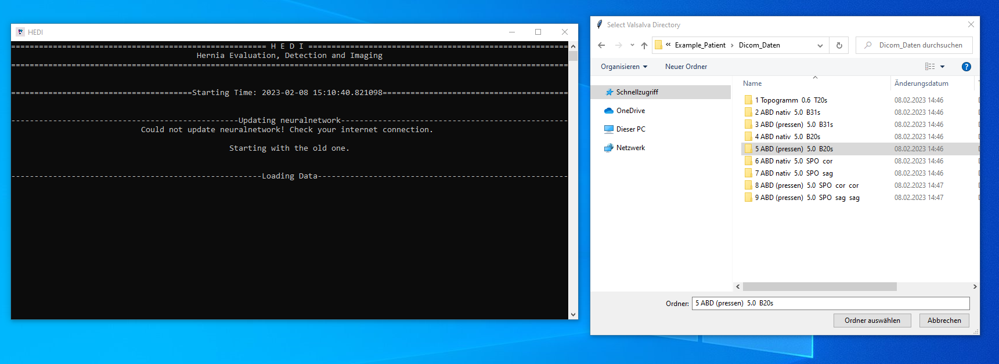
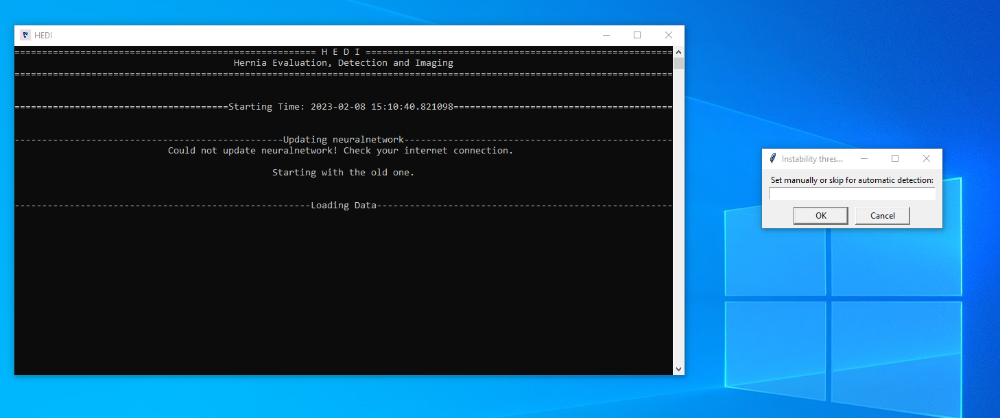

  
-----------
- [Install Dependencies](#install-dependencies)
- [Setup HEDI](#setup-hedi)
- [How to use HEDI](#how-to-use-hedi)
- [Authors](#authors)
- [Citation](#citation)
- [License](#license)
## __Install Dependencies__

#### __Install Git__
Download and install [Git](https://github.com/git-for-windows/git/releases/download/v2.45.1.windows.1/Git-2.45.1-64-bit.exe).

#### __Install Anaconda3__
Download and install [Anaconda3](https://www.anaconda.com/products/individual#windows).  
**Important Note!!!**: Anaconda must be installed within the `%Userprofile%` directory (typically `C:\Users\%USERNAME%\`).

#### __Install Paraview (Version 5.10.1 for Python 3.9)__
Install [Paraview](https://www.paraview.org/download/) in the same `%Userprofile%` directory.

#### __Install NVIDIA Driver__
Download and install the correct Nvidia driver [NVIDIA](https://www.nvidia.com/Download/Find.aspx?lang=en-us).  
Choose *Windows Driver Type:* Standard  
Choose *Recommended/Beta:* Studio Driver

## __Setup HEDI__
#### __Clone HEDI repository__
The repository should be in the directory: `%Userprofile%\git`.
Open the CMD shell and enter:
```
mkdir git
cd git
git clone https://github.com/biomedisa/hernia-repair.git
```

#### __Automatic Setup__
Within the cloned repository lies the batchfile `setup.bat`
Running this file will automaticly create an enviornment 
with all dependencies needed to run HEDI.
Alternatively, you can run the commands manually as described in the next section.

#### __Manual Setup__
Open Anaconda Prompt (e.g. Windows Search `Anaconda Prompt`)
or activate conda within the CMD shell via:
```
call "%Userprofile%\anaconda3\Scripts\activate.bat"
```
Create and activate the conda environment:
```
conda env create -f environment.yml
```
The .yml file contains all infos about the required packages
needed to run HEDI.

You can check if the enviornment was created by:
```
conda activate biomedisa
```

#### __Configure the config file__
Check all paths in the `config_base.py` file, if any paths in this file need a name change also rename the file to `config.py`.
Any further changes should then be restricted to the file named `config.py`.

## __How to use HEDI__
HEDI can be started either by running the `HEDI.bat` batch file or directly from the Anaconda command prompt:
```
conda activate biomedisa
python "%Userprofile%\git\hernia-repair\HEDI_main.py"
```
When running the application the user will be asked by a popup window to select the dataset containing the Dicom data of a patient:


The data is then sorted and stored in the directory `%Userprofile%\Hernia_Analysis_Results\Patient_Name\Dicom_Data`  
Next the user will be asked by a popup window to select the directory within the above directory that contains the data at rest in axial direction:


Afterwards the corresponding data during valslva needs to be selected in the same way:


Lastly the user is asked to select a threshold value for the area of instability (default = 15mm):


Depending on your machine the application now runs for 4-20 min. All files are stored in the above mentioned directory `%Userprofile%\Hernia_Analysis_Results\Patient_Name`. After completion, the final result is presented as an image.

## Authors
* **Philipp D. Lösel**
* **Jacob J. Relle**

## Citation
Please cite the following HEDI preprint:
`Relle, J.J. et al. HEDI: First-Time Clinical Application and Results of a Biomechanical Evaluation and Visualisation Tool for Incisional Hernia Repair. Preprint at https://arxiv.org/abs/2307.01502 (2023).` https://arxiv.org/abs/2307.01502

## License
This project is covered under the **EUROPEAN UNION PUBLIC LICENCE v. 1.2 (EUPL)**.

