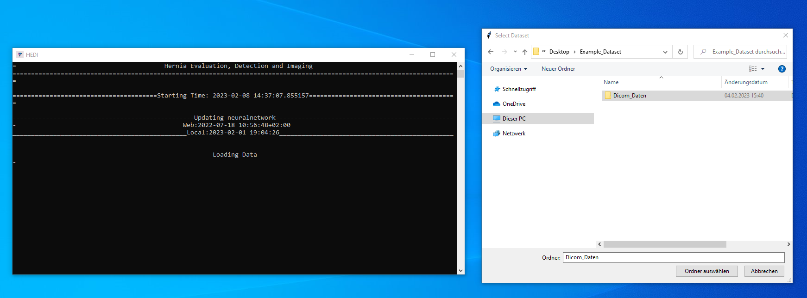
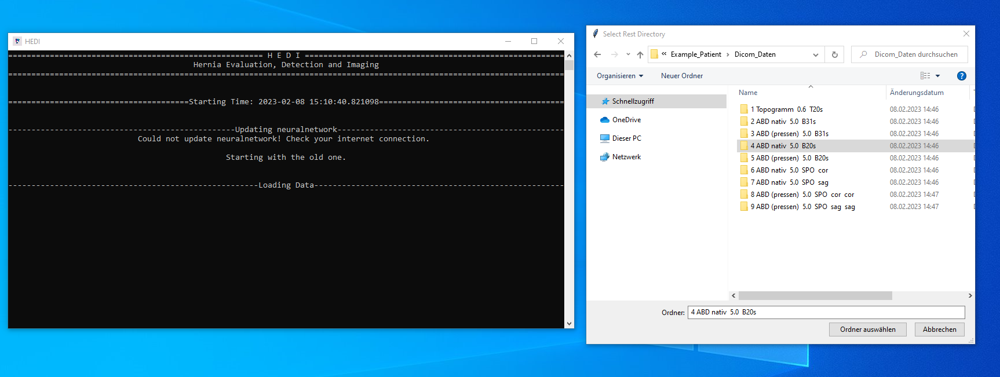
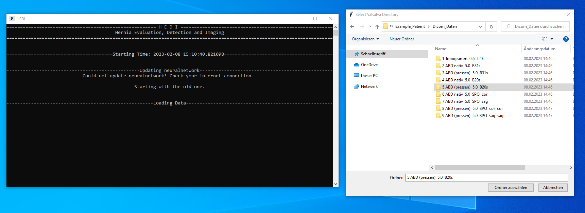
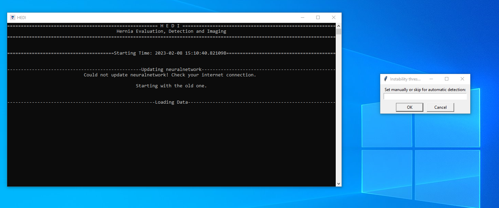

</img>
-----------
[](https://doi.org/10.5281/zenodo.17705516)
- [About](#about)
- [Install Dependencies](#install-dependencies)
- [Setup HEDI](#setup-hedi)
- [How to use HEDI](#how-to-use-hedi)
- [Command Line Usage](#command-line-usage)
- [Authors](#authors)
- [Citation](#citation)
- [License](#license)

## About
HEDI is a tool for the evaluation and visualization of abdominal wall instabilities, hernia size, and hernia volume, using abdominal computed tomography (CT) in combination with the Valsalva manoeuvre. The method enables biomechanical assessment of incisional hernias and supports improved clinical decision-making and surgical planning. For detailed methodology and clinical application, see the original publication:

> Lösel, P. D. *et al.* Clinical application of HEDI for biomechanical evaluation and visualisation in incisional hernia repair. *Commun Med* (2026). https://doi.org/10.1038/s43856-025-01311-w

## __Install Dependencies__

#### __Install Git__
Download and install [Git](https://github.com/git-for-windows/git/releases/download/v2.45.1.windows.1/Git-2.45.1-64-bit.exe).

#### __Clone the HEDI repository__
The repository should be in the directory: `%Userprofile%\git`. Open the CMD shell and enter:
```
mkdir git
cd git
git clone https://github.com/biomedisa/hernia-repair.git
```

#### __Install Anaconda3__
Download and install [Anaconda3](https://repo.anaconda.com/archive/).  
**Important Note!!!**: Anaconda must be installed within the `%Userprofile%` directory (typically `C:\Users\%USERNAME%`).

#### __Install Paraview (Version 5.10.1 for Python 3.9)__
Install [Paraview](https://www.paraview.org/download/). If the installation directory differs from `C:\Program Files\ParaView 5.10.1-Windows-Python3.9-msvc2017-AMD64` you must create a copy of the `hernia-repair\config_base.py` file:
```
copy %Userprofile%\git\hernia-repair\config_base.py %Userprofile%\git\hernia-repair\config.py
```
and adjust the `paraview` entry in `config.py`.

#### __Install NVIDIA Driver for GPU support__
Use Windows Search: `Check for updates` and `View optional updates`  
Windows automatically detects your GPU and installs the required drivers.  
Alternatively, install them manually, e.g. Download and install [NVIDIA](https://www.nvidia.com/Download/Find.aspx?lang=en-us).

## __Setup HEDI__

#### __Automatic Setup__
Within the cloned repository lies the batchfile `setup.bat`
Running this file will automaticly create an enviornment 
with all dependencies needed to run HEDI.
Alternatively, you can run the commands manually as described in the next section.

#### __Manual Setup__
Open Anaconda Prompt (e.g. Windows Search `Anaconda Prompt`)
or activate conda within the CMD shell via:
```
call "%Userprofile%\anaconda3\Scripts\activate.bat"
```
Create and activate the conda environment:
```
conda env create -f %Userprofile%\git\hernia-repair\environment.yml
```
The .yml file contains all infos about the required packages
needed to run HEDI.

You can check if the enviornment was created by:
```
conda activate biomedisa
```

#### __Configure the config file__
Configuration paths are stored in the `config_base.py` file. If you want to adjust any path in this file, you must first create a copy of the `hernia-repair\config_base.py` file:
```
copy %Userprofile%\git\hernia-repair\config_base.py %Userprofile%\git\hernia-repair\config.py
```
and adjust the `config.py` file.

## __How to use HEDI__
HEDI can be started either by running the `HEDI.bat` batch file or directly from the Anaconda command prompt:
```
conda activate biomedisa
python "%Userprofile%\git\hernia-repair\HEDI_main.py"
```
When running the application the user will be asked by a popup window to select the dataset containing the Dicom data of a patient:


The data is then sorted and stored in the directory `%Userprofile%\Hernia_Analysis_Results\Patient_Name\Dicom_Data`  
Next the user will be asked by a popup window to select the directory within the above directory that contains the data at rest in axial direction:


Afterwards the corresponding data during valslva needs to be selected in the same way:


Lastly the user is asked to select a threshold value for the area of instability (default = 15mm):


Depending on your machine the application now runs for 4-20 min. All files are stored in the above mentioned directory `%Userprofile%\Hernia_Analysis_Results\Patient_Name`. After completion, the final result is presented as an image.

#### Remove Biomedisa Environment
Deactivate Biomedisa environment (if activated):
```
conda deactivate
```
Remove the Biomedisa environment:
```
conda remove --name biomedisa --all
```

## __Command Line Usage__
Download and extract the test case: https://biomedisa.info/media/test_patient.zip.  
Activate Biomedisa environment:
```
conda activate biomedisa
```
Run HEDI:
```
python "%Userprofile%\git\hernia-repair\HEDI_main.py" --rest=C:\Users\%USERNAME%\Downloads\test_patient\rest --valsalva=C:\Users\%USERNAME%\Downloads\test_patient\valsalva
```

## Authors
* **Philipp D. Lösel**
* **Jacob J. Relle**

## Citation
> Lösel, P. D. *et al.* Clinical application of HEDI for biomechanical evaluation and visualisation in incisional hernia repair. *Commun Med* (2026). https://doi.org/10.1038/s43856-025-01311-w

## License
This project is covered under the **EUROPEAN UNION PUBLIC LICENCE v. 1.2 (EUPL)**.

